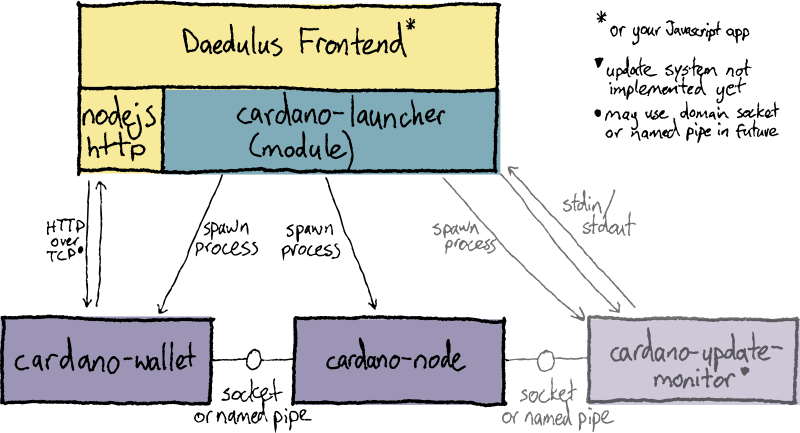
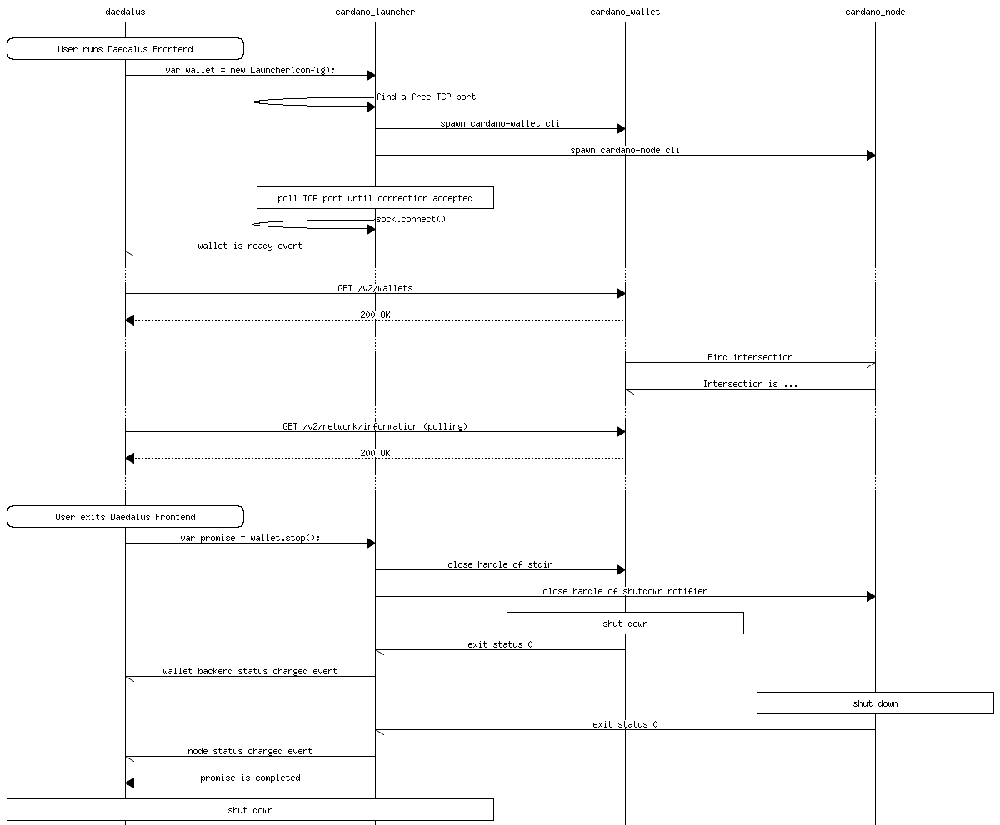

# bcc-launcher Sophie

[](https://github.com/The-Blockchain-Company/bcc-launcher/actions?query=branch%3Amaster)

`bcc-launcher` is a Node.js module for starting
[bcc-wallet](https://github.com/The-Blockchain-Company/bcc-wallet)
and the Sophie
[bcc-node](https://github.com/The-Blockchain-Company/bcc-node).

Its primary user is
[Klarity](https://github.com/The-Blockchain-Company/klarity); however it
could be used by any Javascript application. Tagged versions are published to the [npm Registry](https://www.npmjs.com/package/bcc-launcher) as `bcc-launcher`.

## Documentation

See the generated API docs at https://The-Blockchain-Company.github.io/bcc-launcher/latest/modules.html.

See [docs/example.js](./docs/example.js) for example code.

## Component diagram



## Message sequence diagram - launch




## Local Development

```
nix-shell
```
This runs a bash shell with project development dependencies
(e.g. `npm`, `bcc-wallet`) in the `PATH`. See [nix.md](https://github.com/The-Blockchain-Company/tbco-nix/blob/master/docs/nix.md)
for information on how to set up Nix.

### Build the code

Transpile TypeScript to Javascript in the `dist` directory, checking for errors:

    npm run build

Do the compile as above, but automatically rebuild when a file changes

    npm run build -- --watch

### Run the tests

Runs all tests:

    npm test

To run only `unit` tests matching `idempotent` (for example):

    npm test unit -- -t idempotent

Run the test watcher ([Jest](https://jestjs.io/docs/en/getting-started)) and prompt for usage:

    npm test -- --watch

See the [Jest command-line reference](https://jestjs.io/docs/en/cli) for all the options.

Note that the `cli` tests require the code to already have been built
with `npm run build`.

### Linting and formatting the code

To check linter rules defined in `.eslintrc.json`:

    npm run lint

To automatically fix lint and formatting errors, where possible:

    npm run lint -- --fix

[JavaScript Standard Style](https://standardjs.com/)

### Generate API Documentation

Generates API documentation to the `site` folder.

    npm run typedoc

### Updating bcc-wallet version

To modify the bcc-wallet version, use [`niv update`](https://github.com/nmattia/niv#update).

    nix-shell --run "niv update bcc-wallet -a rev={GIT_TAG}"

or, to use the latest `master` branch revsion:

    nix-shell --run "niv update bcc-wallet --branch master"

The version of `bcc-node` is defined by bcc-wallet because it
has specific version requirements for its backends.

#### Overriding node backend versions

To use your own build of `bcc-node`, export your `PATH`
environment variable so that your build is ahead of those set by the
`nix-shell`.

## Design docs

 * [ADP-92](https://jira.tbco.io/browse/ADP-92) - Jira ticket
   containing user stories and task acceptance criteria.

 * [`update-system-cole.md`](./docs/update-system-cole.md) -
   Overview of how the update system works in the old codebase (Cole
   era).

 * [`windows-clean-shutdown.md`](./docs/windows-clean-shutdown.md) -
   How to stop the wallet and node processes on Windows.

 * [`dev.md`](./docs/dev.md) - Development information.

## Demo CLI

This is a very basic executable that lets you test the compiled
library code from your shell.

```shell script
# Build the javascript first.
npm run build

# bcc-node mainnet
./bin/bcc-launcher sophie mainnet $BCC_NODE_CONFIGS/mainnet ./state-mainnet

# bcc-node testnet
./bin/bcc-launcher sophie testnet $BCC_NODE_CONFIGS/testnet ./state-testnet
```
